### 一、专用模型向通用模型的转变

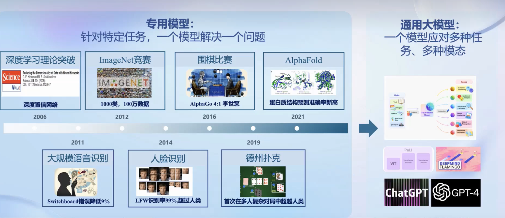大模型受到广泛关注，chatgpt发布后两个月内月活破亿。  
大模型是通向人工智能的关键，是专用模型到通用模型的重要途径。  
专用模型是针对单一任务，而通用大模型是则是面向多任务，多模态，是面向更高阶的智能的潜在途径。

### 二、开源历程

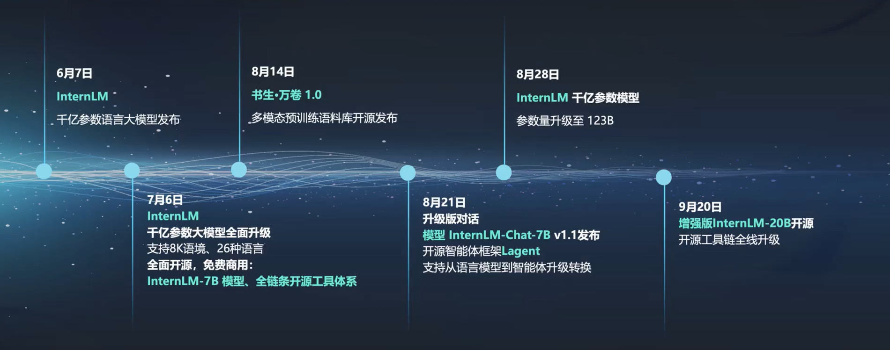

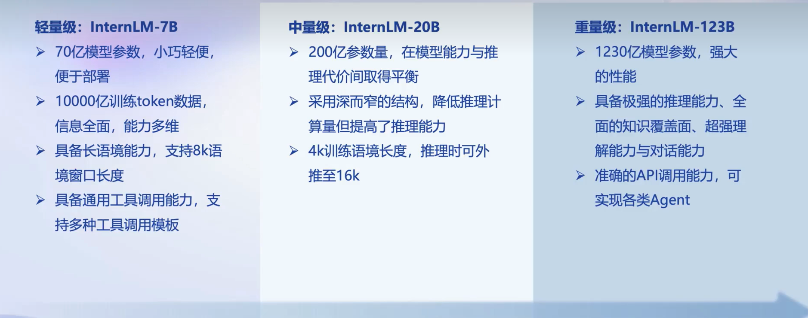

到目前书生浦语大模型一共发布三个模型:
    InternLM-7B ：70亿参数，小巧轻便方便部署，并且支持8k长语境长度，是当前社区低成本可用最佳规模，
    InternLM-20B: 200亿参数，在模型推理能力与推理代价间取得平衡，采用深而窄的结构，降低推理计算量但提高了推理能力。虽只有LIama2-70B的三分之一不到的参数量，但性能却直逼Llama2-70B，是一款商业场景下可开发定制高精度较小规模模型。
    InternLM-123B：千亿参数量使得该模型具备极强的推理能力，全面的只是覆盖面以及超强的理解能力和对话能力

### 三、从模型到应用

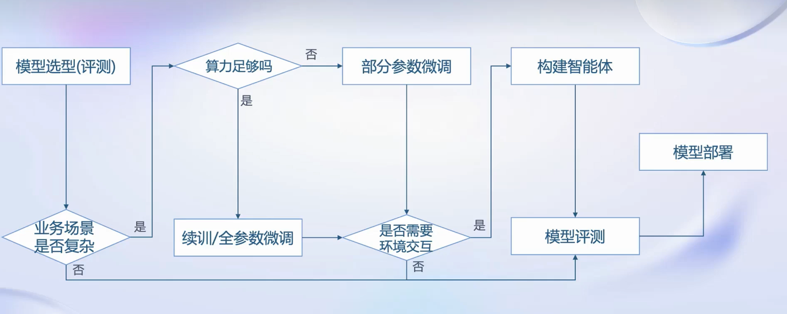

如果业务场景不太复杂，例如想简单的对话，那就直接将模型部署应用即可  
如果业务场景比较复杂，那就需要对模型进行微调，并且还要考虑算力能否支持全面微调，如果不支持就要去坐部分微调（如lora）  
如果业务场景还有环境交互的需求，那就还需要构建智能体

### 四、全链条开源开放体系

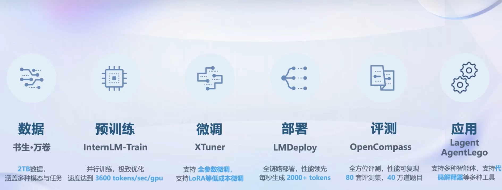

#### 4.1 数据

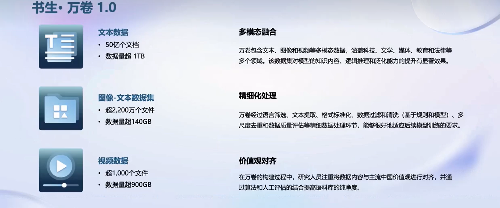

##### 4.1.1多模态融合

多模态融合是指将来自不同感官或数据源的信息整合在一起，以获得更全面、更丰富的理解。这种方法的目的和意义在于提高系统的性能和智能，使其能够更好地模拟人类对世界的多感知和综合性认知能力。以下是多模态融合的一些主要目的和意义：

1. **更全面的信息获取：** 通过整合来自不同感官的信息，系统能够获得更全面、更准确的理解。这有助于解决单一感知模式下可能出现的局限性和不足。

2. **增强鲁棒性：** 多模态融合有助于提高系统对噪音、不确定性和变化的适应能力。当某一感知模态受到干扰或不可用时，其他模态的信息可以填充空缺，提高系统的鲁棒性。

3. **提高识别和理解的准确性：** 结合不同感官的信息可以增强对对象、场景或概念的识别和理解。例如，在语音识别中结合语音和图像信息，可以提高对语音中的关键词的准确性。

4. **丰富用户体验：** 在人机交互领域，多模态融合可以提供更丰富、更自然的用户体验。例如，语音识别、视觉感知和手势识别的结合可以创造更直观的交互方式。

5. **促进跨领域应用：** 多模态融合使得信息可以在不同领域间共享和应用。例如，在自动驾驶中，结合视觉、雷达和激光雷达等多种传感器的信息，可以提高车辆对环境的感知能力。

6. **推动人工智能研究：** 多模态融合是人工智能领域的一个重要研究方向，通过深入研究多模态融合方法，有助于推动整个人工智能领域的发展，促使系统更接近人类的感知和认知能力。

总体而言，多模态融合的目的是通过整合不同感知模态的信息，使系统更全面、更智能地理解和应对复杂的现实世界。这对于提高人工智能系统在各种应用领域的性能和适应性具有重要的意义。

##### 4.1.2 精细化处理

精细化处理以确保数据适用于后续的模型训练。以下是对每个步骤的解释以及可能的做法：

1. **语言筛选：** 数据可能包含多种语言的文本，而模型训练通常需要一种或一组特定语言的数据。因此，语言筛选的目的是从原始数据中选择出目标语言的文本。这可以通过语言识别技术或其他文本处理方法来实现。

2. **文本提取：** 从原始数据中提取出与任务相关的文本信息。这可能涉及到关键信息的抽取、实体识别或其他特定的文本分析技术，以确保模型接收到有用的输入。

3. **格式标准化：** 将数据转换为一致的格式，以便模型可以统一处理。这可能包括将日期、时间、数字等字段标准化为相同的格式，以简化后续的数据处理过程。

4. **数据过滤和清洗：**
   
   - 基于规则：使用预定义的规则来过滤掉不需要的信息或异常数据。例如，删除重复记录、处理缺失值、去除噪音等。
   - 基于模型：利用机器学习模型来识别和过滤掉异常或不符合预期模式的数据。这可以是异常检测、离群值检测等任务。

5. **多尺度去重：** 在数据中进行去重操作，确保同一信息不会出现在训练集中的多个样本中。这有助于避免模型在训练时对重复信息过度拟合，并提高模型对真实多样性的泛化能力。

6. **数据质量评估：** 对清洗后的数据进行质量评估，以确保数据的可靠性和合理性。这可以包括统计分析、可视化、以及其他质量评估的方法。不仅要关注整体数据质量，还要检查数据在不同特征和维度上的分布。

**做法：**

- **自动化处理：** 使用脚本、工具或流程自动化来执行上述数据处理步骤，以提高效率和一致性。
- **可视化和统计分析：** 使用可视化工具和统计方法来深入了解数据的特征和分布，以指导数据处理决策。
- **迭代性处理：** 数据处理通常是一个迭代的过程。在每个步骤后，都要检查数据的效果，并根据需要调整和改进处理方法。
- **记录处理步骤：** 记录每个数据处理步骤的操作和决策，以便在需要时进行审查和追溯。这有助于保持整个数据处理过程的可追溯性和可重复性。

##### 4.1.3 价值观对齐

研究人员注重将数据内容与主流中国价值观进行对齐，并通过算法和人工评估的结合提高语料库的纯净度，具有以下重要意义：

1. **文化适应性：** 中国价值观在语言和文化方面具有独特性。通过将数据内容与主流中国价值观对齐，可以确保语料库更好地反映当地文化特征，提高模型在中国文本处理任务中的适应性。

2. **模型性能提升：** 如果训练数据能够更好地反映目标社会的价值观，那么模型在相关任务上的性能很可能会更好。例如，在情感分析或社会舆论分析中，对中国价值观的准确理解将帮助模型更精准地识别和理解文本中的情感和观点。

3. **减少偏见和误解：** 在处理自然语言时，特定文化背景下的词汇和表达方式可能会带有多义性。通过对齐主流中国价值观，可以减少模型对文本的误解和产生偏见的可能性，提高模型在处理中文文本时的准确性。

4. **社会责任和合规性：** 在某些敏感领域，如舆情监测、社会舆论分析等，确保对中国价值观的理解与社会价值的一致性对于模型的应用是至关重要的。这有助于确保技术的合规性，避免因为模型产生的输出与主流价值观相悖而引起的争议。

5. **提高语料库纯净度：** 通过算法和人工评估的结合，可以更全面、深入地筛选和清理语料库中的不符合价值观的内容。这有助于生成更高质量、更纯净的语料库，提高模型训练的效果。

6. **增强社会认同感：** 在一定程度上，通过将数据与主流价值观对齐，可以增强模型在社会中的认同感。这有助于促进模型的广泛应用，并避免因为模型输出与社会价值观不符而引发争议。

总体而言，将数据内容与主流中国价值观对齐，通过算法和人工评估的结合提高语料库的纯净度，有助于确保模型在处理中文文本时更好地符合社会、文化和伦理规范，提高其实际应用的可行性和可接受性。

#### 4.2 预训练

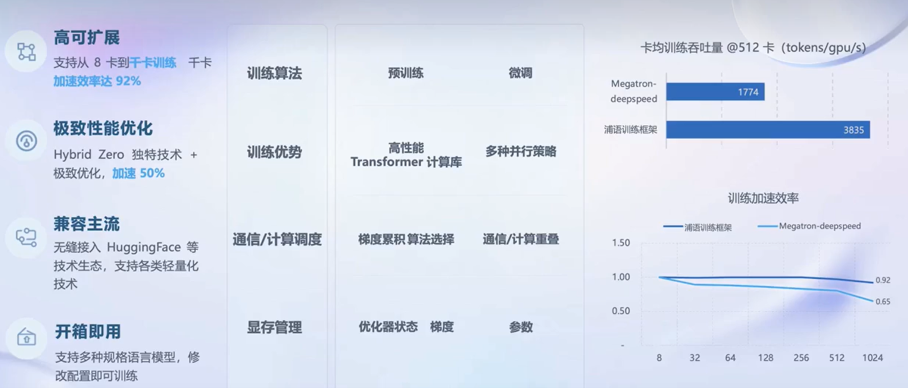

* 高可扩展 支持多卡甚至千卡训练  

* 极致性能优化  采用Hybrid Zero独特技术+极致优化，加速50%  

* 兼容主流  无缝接入huggingFace灯技术生态  

* 包含多种规格的语言模型

#### 4.3 微调：增量续训和有监督微调

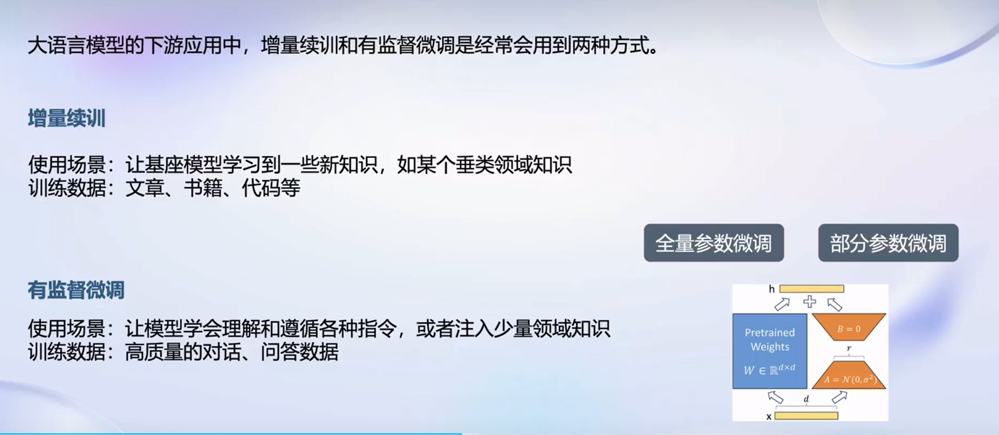

##### 4.3.1 增量续训

增量续训（Incremental Learning）是机器学习中的一种训练策略，它允许在已经训练好的模型基础上，通过继续使用新的数据进行进一步的训练，从而不必重新从头开始训练整个模型。这样的方法对于处理新数据、适应变化以及保持模型更新是非常有用的。以下是对增量续训的一些关键理解点：

1. **已有模型基础：** 增量续训建立在已有模型的基础上。这个已有的模型通常是在之前的训练任务中获得的，并且可能已经学到了一些特征和模式。

2. **新数据引入：** 增量续训的核心是引入新的数据，将这些新数据与已有的数据结合，然后使用这些组合的数据对模型进行更新。新数据可能属于与之前训练任务相似或相关的领域，也可能是完全不同的任务。

3. **避免遗忘：** 在进行增量续训时，需要考虑到不会丢失或遗忘已有模型所学到的知识。这通常通过采用一些策略，如经验回放、正则化技术等来实现，以确保新数据的引入不会对旧有的知识造成负面影响。

4. **灵活性：** 增量续训使得模型在适应新数据的同时保持灵活性。这对于应对动态变化的环境、新兴问题或数据分布的演变非常重要。

5. **资源效率：** 相对于重新训练整个模型，增量续训通常更加资源效率。这是因为只有模型的一部分需要更新，而不是整个模型。

6. **领域自适应：** 增量续训有助于模型进行领域自适应，即在不同的领域之间进行平滑迁移。这对于处理新兴问题、新的应用场景或者不断变化的数据分布非常有帮助。

7. **在线学习：** 在一些场景中，增量续训与在线学习（Online Learning）概念紧密相关。在线学习强调模型通过不断接收新数据而持续更新，而增量续训则是在线学习的一种具体实现方式。

总体而言，增量续训提供了一种灵活、高效的模型更新方法，使得模型能够适应不断变化的环境和数据，同时保持已有知识的积累。

增量续训在大模型中有许多实际应用场景，尤其是当面临新数据、不断演化的任务或者需要保持模型更新时。以下是一些增量续训在大模型中的常见使用场景：

1. **自然语言处理 (NLP) 模型：**
   
   - **领域适应：** 在大规模语言模型中，通过增量续训可以实现领域适应，使模型更好地适应特定行业、专业领域或用户群体的语言特点。
   - **新词汇学习：** 针对新出现的词汇，通过增量续训来更新模型的词汇表，使其能够理解和处理最新的术语和语言变化。

2. **计算机视觉模型：**
   
   - **新类别学习：** 在图像分类任务中，当需要处理新类别的图像时，可以使用增量续训来更新模型，以便它能够识别和分类新类别。
   - **细粒度任务：** 在大规模的图像识别模型中，通过增量续训可以实现对特定细粒度任务的优化，例如品牌识别、特定场景下的物体检测等。

3. **语音识别系统：**
   
   - **个性化语音模型：** 对于语音助手或语音识别系统，可以通过增量续训来实现个性化，使其更好地适应用户的语音特点、口音和个性化需求。
   - **新发音学习：** 针对新的发音或词汇，通过增量续训来改善语音识别系统对新发音的理解和适应能力。

4. **推荐系统：**
   
   - **用户兴趣变化：** 在大规模的推荐系统中，用户兴趣可能会随时间变化。通过增量续训，推荐系统可以及时地适应用户新的兴趣和行为模式。
   - **新物品引入：** 当新的商品或服务引入时，通过增量续训可以让推荐系统了解并适应新物品的特性，确保推荐的准确性。

5. **深度强化学习模型：**
   
   - **环境变化：** 在强化学习中，当任务的环境或规则发生变化时，可以使用增量续训来使智能体适应新的环境。
   - **策略更新：** 在需要不断学习和优化策略的情境下，增量续训可以用于更新深度强化学习模型的策略。

在这些场景中，增量续训可以避免重新训练整个模型，提高效率，同时确保模型保持对新数据和任务的适应性。这对于大规模模型的长期维护和应对不断变化的任务环境非常重要。

##### 4.3.2 有监督微调

有监督微调（Supervised Fine-Tuning）是指在已经预训练好的模型基础上，使用带有标签的新数据集进行进一步的训练。该方法通常应用于迁移学习的框架下，通过在新任务上微调预训练模型，使其适应新的任务要求。以下是有监督微调的一些关键理解点以及在大模型中的应用：

**理解有监督微调：**

1. **预训练阶段：** 有监督微调通常开始于一个在大规模数据上进行预训练的模型，例如在自然语言处理中的BERT、图像处理中的ResNet等。这个预训练过程使模型学到了一些通用的特征和知识。

2. **新任务引入：** 随后，当面临一个新的具体任务时，例如特定领域的文本分类或图像识别，可以使用带有标签的新数据集来微调已经预训练好的模型，以适应新任务的要求。

3. **模型参数更新：** 在微调过程中，通过使用新任务数据进行反向传播和梯度下降等优化方法，模型的参数被更新，以使模型更好地适应新任务的特征。

4. **冻结和微调层：** 有时候，为了保留预训练模型学到的通用特征，可以选择冻结一部分或全部的模型层，只微调部分层的参数。这有助于防止在微调阶段遗忘已学到的知识。

**在大模型中的应用场景：**

1. **自然语言处理 (NLP) 模型：**
   
   - 在预训练的语言模型（如BERT、GPT）上，通过有监督微调进行特定任务的适应，如文本分类、命名实体识别等。
   - 针对特定领域的NLP任务，通过微调模型以适应领域相关的语言特点。

2. **计算机视觉模型：**
   
   - 在预训练的卷积神经网络（如ResNet）上，通过有监督微调进行图像分类、目标检测等任务。
   - 针对特定场景或数据集，通过微调模型以适应特殊图像处理需求。

3. **推荐系统：**
   
   - 在已有的推荐模型上，通过有监督微调以适应新的用户行为数据，提高推荐的个性化程度。
   - 针对不同产品或服务的推荐任务，通过微调模型以适应新的推荐需求。

4. **语音识别系统：**
   
   - 在预训练的语音识别模型上，通过有监督微调以适应特定说话人的语音特征。
   - 针对特定环境或应用场景，通过微调模型以提高语音识别的准确性。

有监督微调在大模型中的应用使得模型更灵活，能够在已有知识的基础上快速适应新任务，避免了从零开始训练的资源和时间成本。这种迁移学习策略被广泛用于实际应用中。

#### 4.4 高效微调框架 XTuner

#### 4.5 评测体系

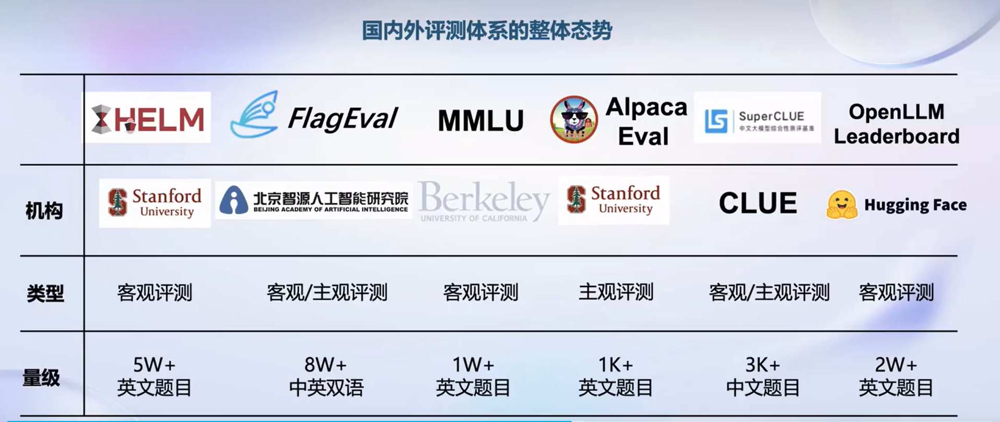

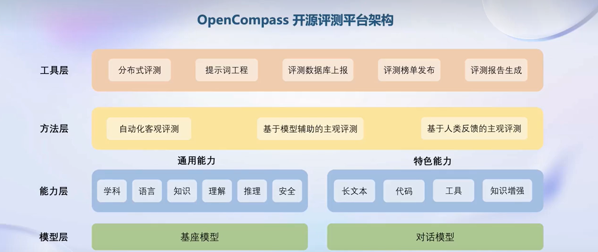

OpenCompass分为四层分别为模型层、能力层、方法层、工具层

#### 4.6 部署

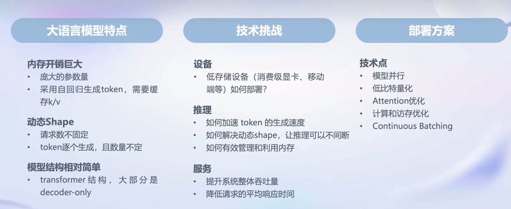

#### 4.7 智能体

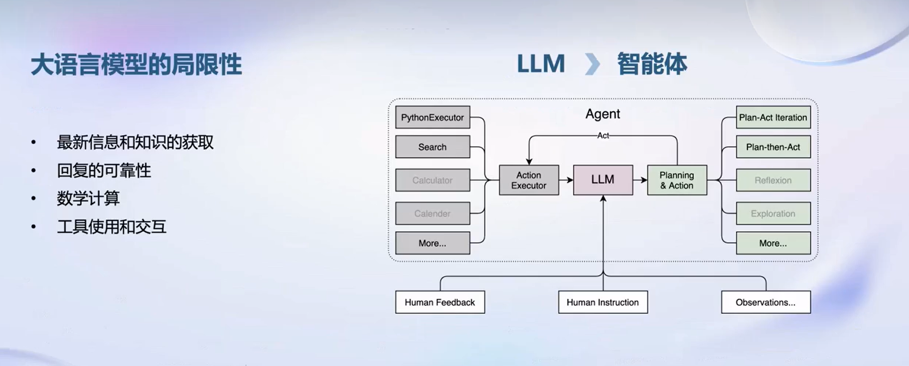

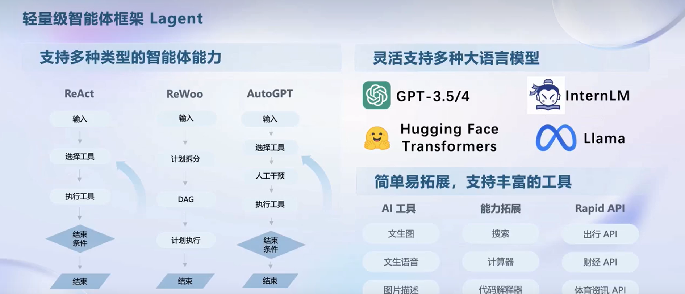

* 灵活支持多种大语言模型  例如gpt-3.5/4 Llama huggingface  

* 简单易拓展，支持丰富的工具  

* 支持多种类型的智能体能力  例如ReAct，ReWoo，AutoGPT

#### 4.8 多模态智能体工具箱AgentLego

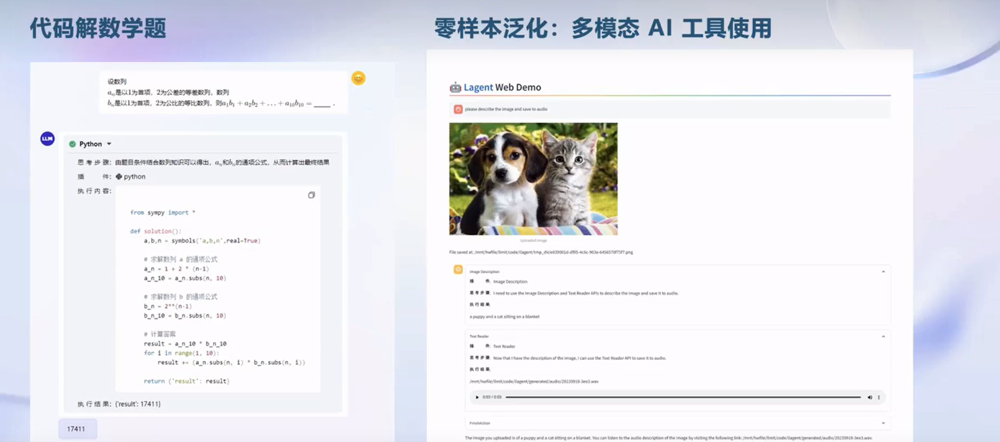

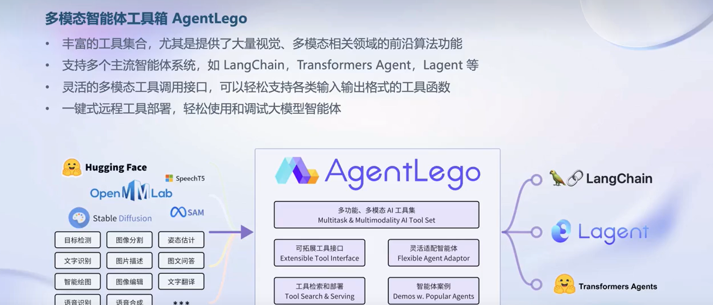
